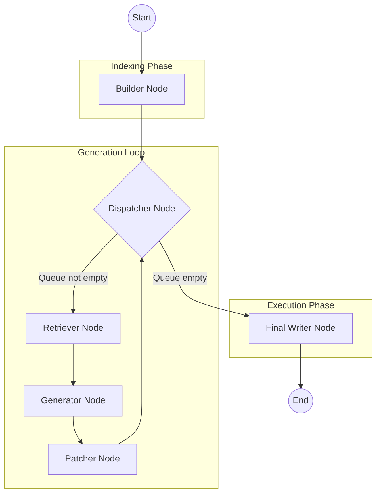

# Docstringify

`docstringify` is a command-line tool that automatically generates high-quality Python docstrings by analyzing your codebase's structure. It uses a database-centric RAG (Retrieval-Augmented Generation) approach to understand code relationships and dependencies, ensuring that generated docstrings are contextually accurate and follow the Google style guide.

## Features

-   **Automated Indexing:** Parses your Python project using `ast` to build a comprehensive call graph and structural model.
-   **Context-Aware Generation:** Uses RAG to retrieve relevant code snippets (dependencies and usages) to provide the LLM with the full context of how a function or class is used.
-   **Intelligent Patching:** Automatically inserts or updates docstrings in your source files while preserving existing formatting and indentation.
-   **LangGraph Orchestration:** Uses a state-of-the-art agentic workflow to manage the generation process.

## Workflow

The tool operates through a series of specialized nodes managed by LangGraph:



1.  **Builder:** Parses the repository and populates a SQLite database if it's empty.
2.  **Dispatcher:** Manages the queue of undocumented functions and classes.
3.  **Retriever:** Fetches context (dependencies and dependents) from the call graph for the target code.
4.  **Generator:** Uses a local LLM (via Ollama) to generate the Google-style docstring.
5.  **Patcher:** Formats the docstring and prepares the file modification state.
6.  **Final Writer:** Safely writes all accumulated changes back to the source files in one pass.

## Installation

The project uses `uv` for dependency management.

### Prerequisites

-   Python >= 3.12
-   [uv](https://github.com/astral-sh/uv)
-   [Ollama](https://ollama.com/) (running with the `qwen3:4b-instruct` model or your preferred model)

### Install as a CLI tool

```bash
# From the repository root
uv tool install .
```

### Install for development

```bash
uv sync
uv pip install -e .
```

## Usage

Simply point `docstringify` to the directory of the Python project you want to document:

```bash
docstringify /path/to/your/project
```

The tool will create an `autodoc.db` file in the target directory to store the index and then begin generating docstrings.

## Evaluation

The project includes an evaluation suite using `ragas` and `weave` to measure the quality of generated docstrings.

1.  **Authenticate with Google Cloud:**
    ```bash
    gcloud auth application-default login
    ```

2.  **Run Evaluation:**
    ```bash
    python evaluate.py
    ```

## Project Structure

-   `docstringify/main.py`: CLI entry point using `typer`.
-   `docstringify/agent.py`: LangGraph workflow and node definitions.
-   `docstringify/db.py`: SQLite database schema and Peewee models.
-   `docstringify/injector.py`: Repository scanning and AST parsing logic.
-   `docstringify/retrievers.py`: SQL-based RAG context retrieval.
-   `docstringify/code_parser.py`: AST visitor for extracting code structure and calls.
